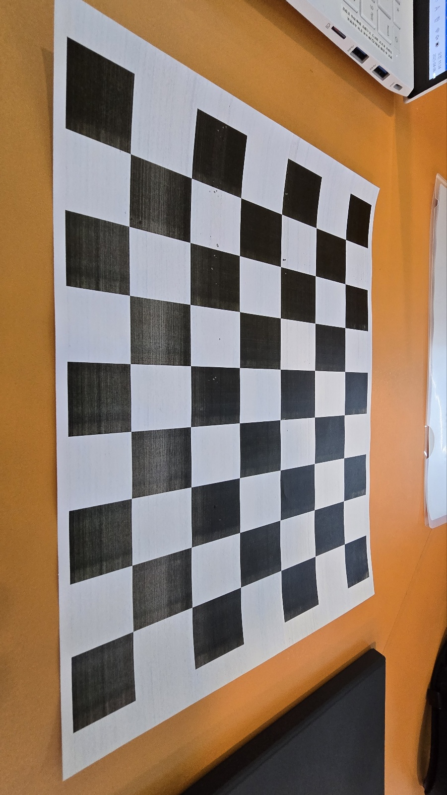

# flatten_your_chessboard
당신의 카메라를 평평하게 펴드립니다!


## 요약
촬영한 chessboard가 휘어 보인다거나, 어색한 느낌이 드는 분들을 위해 준비했습니다. 그 문제를 바로 해결해드립니다.


## 사용 설명서
### chessboard 촬영
1. 핸드폰 또는 웹캠을 준비합니다.
2. 당신이 가지고 있는 chessboard가 `구겨지지 않은` 상태로 다양한 각도 및 거리에서 영상 촬영을 합니다.
   !만약, 구겨져 있다면...잘못된 결과가 나올지도 몰라요...

### 코드에 옮기기
1. 촬영한 chessboard의 가로X세로 크키와 저장된 경로를 꼭! 확인하세요.
   !주의. chessboard size는 검정색판과 흰색판이 교차되면서 만나는 모서리의 수 입니다!

2. 확인하신 사이즈와 경로를 해당 코드에 추가해주세요.
```
chessboard_size = (8, 6)
video_path = "D:\\ComputerVision\\CV_image\\my_chessboard.mp4"
```
위의 사이즈와 경로는 예시입니다!

### calibration 실행
1. 실행하시면 이런 결과값이 나옵니다.


카메라의 매트릭스 구조에 따른 결
[[fx  0  cx]
 [ 0  fy cy]
 [ 0   0  1]]
fx: 663.67446852 (초점 거리, x축 방향)
fy: 670.24245629 (초점 거리, y축 방향)
cx: 632.95774199 (광학 중심, x축 좌표)
cy: 383.39841492 (광학 중심, y축 좌표)

왜곡 계수
k1: 0.021330595
k2: -0.021229183
p1: 0.0029797878
p2: 0.00125712
k3: 0.02130314

재투영 오차
RMSE: 0.9181

위의 수치들은 calibration_data.npz 파일에 저장됩니다.

### 왜곡 보정하기
1. 보정하고 싶은 chessboard의 경로를 확인 후 올려주세요.
```
img = cv.imread("D:\\ComputerVision\\CV_image\\my_distortion_image.jpg")
```


2. 이후 결과값을 보며 이전 사진과 비교해보세요.

