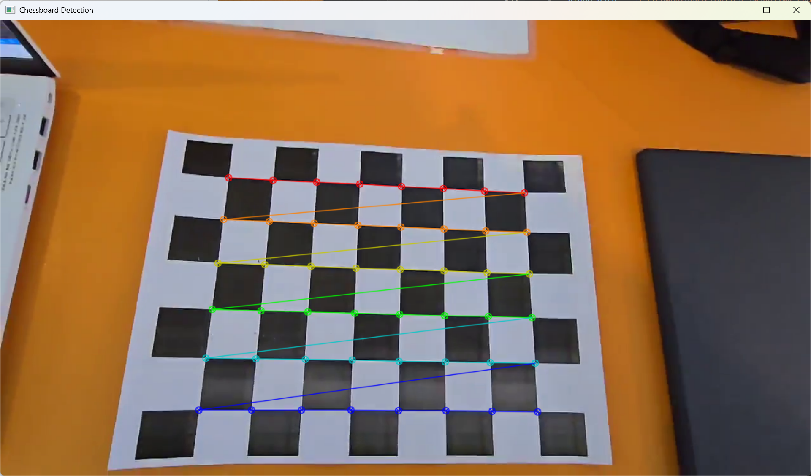
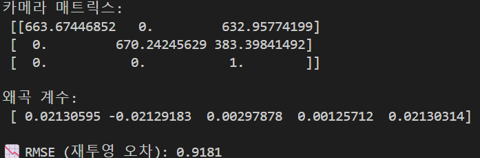
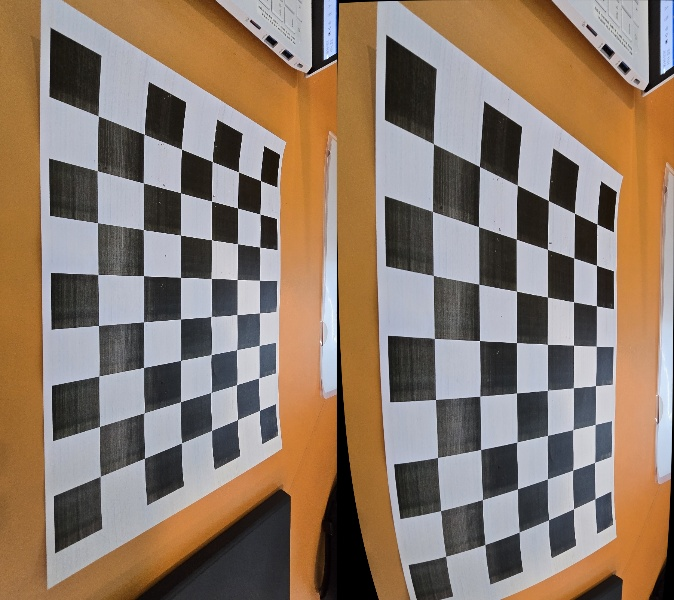

#  flatten_your_chessboard

**당신의 카메라를 평평하게 펴드립니다!**  
왜곡된 체스보드 영상도 문제없어요.  
이 도구는 OpenCV를 활용해 체스보드를 기반으로 **카메라 캘리브레이션 및 왜곡 보정**을 자동으로 수행합니다.

---

##  개요

체스보드를 촬영했는데 휘어 보이거나 뭔가 어색한가요?  
그건 **카메라 렌즈의 왜곡(distortion)** 때문일 수 있어요!  
`flatten_your_chessboard`는 카메라의 내부 파라미터를 추정하고, 렌즈 왜곡을 보정해서 이미지를 평평하게 만들어줍니다.

---

##  사용 방법

### 1. 체스보드 촬영하기

1. 핸드폰 또는 웹캠을 준비하세요.
2. **구겨지지 않은 체스보드**를 다양한 각도와 거리에서 영상으로 촬영해주세요.

>  **주의:** 체스보드가 구겨져 있으면 잘못된 결과가 나올 수 있어요!

---

### 2. 코드 설정하기

1. 영상에 사용한 체스보드의 크기와 영상 경로를 확인하세요.

>  **체스보드 크기란?**  
검정색과 흰색 판이 교차하며 만나는 **내부 모서리 개수**입니다.  
예를 들어, 체스보드가 9x7 격자라면 크기는 `(8, 6)`입니다.


2. 아래 코드에 크기와 영상 경로를 입력합니다:

```python
chessboard_size = (8, 6)
video_path = "D:\\ComputerVision\\CV_image\\my_chessboard.mp4"
```

---

### 3. 캘리브레이션 실행

1. 캘리브레이션을 실행하면 다음과 같은 결과가 출력됩니다:



####  카메라 매트릭스 구조

```
[ [fx  0  cx]
  [ 0  fy cy]
  [ 0   0  1] ]
```

- `fx`: 663.67446852 (초점 거리, x축)
- `fy`: 670.24245629 (초점 거리, y축)
- `cx`: 632.95774199 (광학 중심, x좌표)
- `cy`: 383.39841492 (광학 중심, y좌표)

####  왜곡 계수 (Distortion Coefficients)

- `k1`: 0.021330595  
- `k2`: -0.021229183  
- `p1`: 0.0029797878  
- `p2`: 0.00125712  
- `k3`: 0.02130314  

####  재투영 오차 (RMSE)

- `RMSE`: 0.9181  

> 위 결과는 `calibration_data.npz` 파일로 저장됩니다.

---

### 4. 왜곡 이미지 보정하기

1. 보정하고 싶은 이미지 경로를 코드에 입력하세요:

```python
img = cv.imread("D:\\ComputerVision\\CV_image\\my_distortion_image.jpg")
```

2. 결과 이미지 예시:



> 이제 휘어 보이던 체스보드 이미지도 **정확하고 평평하게** 보이게 됩니다!

---

##  추가 팁

- 다양한 각도에서 20장 이상의 체스보드 프레임을 수집하면 정확도가 올라갑니다.
- 실시간 보정을 원한다면 웹캠 스트리밍을 결합해 확장할 수 있어요.
- `.npz` 파일은 OpenCV의 `cv2.FileStorage`를 사용해서 불러올 수도 있습니다.

---
